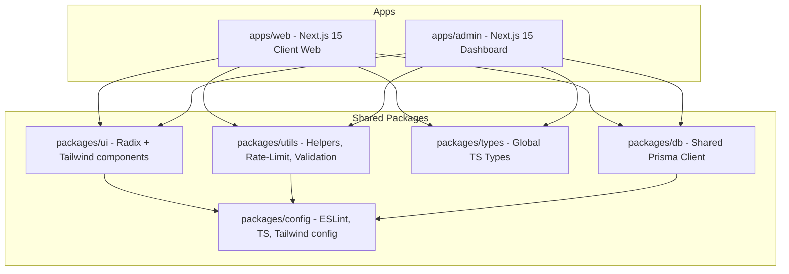

# RESTO HUB - AI ENGINEERING RULES AND DEVELOPMENT GUIDE

This document defines the strict coding guidelines, architecture boundaries, security/performance standards, and agent execution workflows for the Resto Hub monorepo. All AI assistants and human developers working in this workspace must read and adhere to these guidelines.

---

## 1. MANDATORY AI WORKFLOWS & EXECUTION

### A. AI Execution Workflow (Sequence of Operations)

Every AI task in this repository must follow this sequence before making changes:

1. **Read Rules First**: Read `/.agents/AGENTS.md` before analyzing any files.
2. **Understand Existing Code**: Open and read the relevant source files and documentation in the area of modification.
3. **Search for Reusable Items**: Perform a workspace-wide search for existing components, utilities, hooks, types, APIs, or database queries that can be used or extended.
4. **Implement Solution**: Modify code following the project's exact coding conventions, using `@resto-hub/*` packages.
5. **Verify Changes**: Run lint, type-checking, and build commands to confirm no regressions.
6. **Update Guide**: If new architectures, packages, or conventions are introduced, update `.agents/AGENTS.md` first.

### B. "Reuse Before Create" Rule

- **Search First**: Before creating any new helper function, component, database query, form schema, or state hook, you MUST search through `packages/` (`ui`, `utils`, `types`, `config`) and local directories (`lib/`, `shared/components/`) to check if a similar helper or logic already exists.
- **Extend, Don't Duplicate**: Prefer extending existing components or utilities by adding optional properties or parameters. Creating duplicate logic (e.g., repeating slugification, formatting, or fetch wrapping) is strictly forbidden.
- **Import Scopes**: Reuse shared code using workspace imports:
  - Component imports: Use `@resto-hub/ui` for basic components (Button, Input, Card, Table, Dialog, etc.) and `cn` for styling.
  - Utility/Format imports: Use `@resto-hub/utils` (e.g., format price, format dates, rate limiters, validation).
  - Config imports: Use `@resto-hub/config` (Tailwind, tsconfig, eslint configs).

### C. AI Decision Workflow

1. Analyze the request against the existing system boundaries.
2. Determine if it touches client-facing apps (`apps/web`), admin systems (`apps/admin`), database schemas (`prisma/`), or shared packages (`packages/`).
3. Make decisions based on repository-specific constraints (e.g. Next.js 15 async routing params, Prisma Client connection pooling).

### D. Feature Implementation Workflow

1. **Database Schema**: Update [schema.prisma](file:///Users/dabeeovina/Documents/sdmtsd-resto/prisma/schema.prisma) with correct indices, constraints, and relationships.
2. **Generate Client**: Run `pnpm db:generate` to regenerate the Prisma client.
3. **Export Types**: Define necessary API types/schemas under `packages/types/src` or `packages/utils/src/validation`.
4. **Build API Route**: Implement route handlers in `apps/admin/src/app/api/` using HOC auth wrappers (`withAuth`/`withAuthParams`) and custom manual ordering (`createOrdered`/`updateOrdered` in `apps/admin/src/lib/ordering.ts`) if sort order is needed.
5. **Add Components**: Add shared primitives in `@resto-hub/ui` using Radix + class-variance-authority, or feature components locally.
6. **Client-Side Fetch**: Call endpoints in the admin UI using the token-refresh-aware fetch helper `api` from `apps/admin/src/lib/api-client.ts`.
7. **Public Web UI**: Implement customer-facing interfaces in `apps/web/src/app/[locale]/` with dynamic localized text bundles and static params generation.

### E. Bug Fix Workflow

1. Locating the bug: Identify if it is backend/API, database, auth middleware, localization matcher, client-side fetch, or dynamic rendering (Next.js SSR vs client component).
2. Code review: Verify error logs or exceptions against the system's resilience boundaries (e.g. fire-and-forget `recordAudit` catch blocks, Prisma concurrent transaction retry limits).
3. Implementation: Fix the issue preserving the exact logic interface, type checks, and security settings.

---

## 2. ARCHITECTURE & MODULE BOUNDARIES

Resto Hub is a monorepo managed via **Turborepo** and **pnpm workspaces**. It enforces strict isolation boundaries:

### Module Boundaries

- **No Direct cross-app imports**: Code in `apps/web` must NEVER import anything directly from `apps/admin`, and vice versa. Shared code must go to `packages/*`.
- **UI Component isolation**: `packages/ui` handles layout/visual styles. It contains headless UI controls using Radix primitives. Avoid placing business-specific data fetches inside the shared `packages/ui`.
- **Prisma Client Isolation**: All apps must import the Prisma singleton from `@resto-hub/db` rather than instantiating `new PrismaClient()` locally. This ensures connection pool limitations and database client settings are shared correctly.

---

## 3. DEPENDENCY RULES

- **Corepack Requirement**: This project locks the package manager to `pnpm@11.8.0` and Node.js `>=22`. Always run commands using this version via corepack activation.
- **Dependency Declaring**:
  - Dev dependencies of shared packages must be registered in the workspace root or local packages.
  - Package dependencies: Use `workspace:*` specifiers for internal packages inside the `dependencies` block of `package.json` (e.g. `@resto-hub/db: "workspace:*"`).

---

## 4. PERFORMANCE OPTIMIZATION

### A. Next.js 15 Async Routing Parameters

Next.js 15 models route parameters and search parameters as Promises. You MUST await params before accessing their properties in:

- Page components: `export default async function Page({ params }: { params: Promise<{ id: string }> })`
- Layout components: `export default async function Layout({ params }: { params: Promise<{ locale: string }> })`
- API route dynamic params context: `async (request: NextRequest, ctx: { params: Promise<{ id: string }> }) => { const { id } = await ctx.params; ... }`

### B. Incremental Static Regeneration (ISR)

- For public web pages (e.g., menus, home, events), specify caching properties:
  `export const revalidate = 3600; // 1 hour`
- Set up static parameters inside layouts/pages to leverage fast static rendering:
  `export function generateStaticParams() { return [{ locale: "en" }, { locale: "ja" }]; }`
- Call `setRequestLocale(locale)` inside static layouts/pages to allow proper static compilation under `next-intl`.

### C. Prisma Client Optimization

- **Starvation Guard**: Keep connection pool and timeout parameters locked in the shared `buildDatasourceUrl` helper:
  `connection_limit=10`, `pool_timeout=30`.
  Do not overwrite these settings unless database concurrency levels explicitly require it.
- **Data Serialization**: When querying models from Server Components and passing them to Client Components, do not pass raw Prisma objects containing complex types (like dates, BigInt, or decimals) directly. Map them to serialized primitives first.

---

## 5. UI/UX, RESPONSIVE DESIGN & ACCESSIBILITY

### A. Design Aesthetic Tokens

- **Theme**: Dark mode default (`html lang="..." className="dark"`).
- **Primary Palette**:
  - Backgrounds: DEFAULT `#0F0D0B`, secondary `#1A1714`, tertiary `#252119`.
  - Accents: Gold (`#C9A96E`), Wood (`#A87D44`).
  - Borders: DEFAULT `#3A3228`, light `#4D4235`.
  - Fonts: Inter (Sans-serif) and `"Noto Sans JP"` (Japanese).
- **Gradients**:
  - `gold-gradient`: `linear-gradient(135deg, #C9A96E 0%, #D4AE66 50%, #B08B4A 100%)`
  - `wood-pattern`: `linear-gradient(135deg, rgba(58,40,25,0.3) 0%, rgba(82,57,35,0.2) 50%, rgba(58,40,25,0.3) 100%)`

### B. Micro-Animations

- Always use smooth transitions for hover, focus, and state transitions.
- Flash new items using the custom CSS keyframes `.animate-highlight-flash` to attract attention gracefully.

### C. Responsive Design

- Ensure full mobile optimization: Web layouts must implement the `MobileBottomNav` for viewport widths under `lg`, and the side/top headers for desktop viewports.
- Restyle scrollbars in containers using the custom Webkit scrollbar selectors matching the border colors and gold accent on hover:
  `::-webkit-scrollbar { width: 6px; }`

### D. Accessibility (a11y) Rules

- **Radix UI Primitives**: Use Radix primitives inside `packages/ui` (Dialog, Alert-Dialog, Dropdown, Select, tabs, switches) as they handle focus locking, keyboard navigation, and aria tags.
- **Semantic HTML**: Maintain appropriate HTML5 semantic layouts (`<main>`, `<section>`, `<nav>`, `<header>`, `<footer>`, `<aside>`).
- **Focus Rings**: Never disable outline rings on focus/active without adding a visible high-contrast outline state.

---

## 6. SECURITY

### A. Session & Authentication

- **Access Tokens**: Short-lived (15 minutes/900 seconds) JWT access tokens.
- **Refresh Tokens**: Stored in a strict HTTP-only, secure (for production), strict sameSite cookie named `refreshToken`, with a 7-day expiration.
- **JWT Keys**: Implement fail-fast checks. Throw errors if `JWT_SECRET` or `JWT_REFRESH_SECRET` are not set on start-up.

### B. API Client Queueing

- The client-side fetch wrapper (`apiClient`) in `apps/admin/src/lib/api-client.ts` implements a shared refresh promise (`refreshPromise`) and locks `isRefreshing`. Ensure this mechanism is preserved so concurrent 401s do not trigger duplicate refresh calls.

### C. Rate Limiting

- Use the lightweight Map-based rate limiter helper `rateLimit` on endpoints vulnerable to brute force (e.g. `/api/auth/login`).
- Resolve IP addresses through safe header checks using `getClientIpFromHeaders` (extracting the first entry from `x-forwarded-for`, falling back to `x-real-ip`).

---

## 7. SEO METADATA & LOCALIZATION

### A. Localization (next-intl)

- Default locale: `ja` (Japanese). Supported locales: `ja`, `en`.
- Handle path localization using the middleware matching configurations.
- All client-visible strings must be managed in localized files under `apps/web/src/i18n/messages/{locale}.json`. Avoid hardcoding text.

### B. SEO Primitives

- Inject JSON-LD Schema structured data (`@context: "https://schema.org"`) in layout layouts for restaurant metadata, hours, and geo-coordinates.
- Handle metadata templates globally:
  `title: { default: "Resto Hub", template: "%s | Resto Hub" }`

---

## 8. ERROR HANDLING & RESILIENCY

### A. Schema Verification

- Always wrap body data with safe schema checks using Zod: `schema.safeParse(body)`.
- On input validation failure, return a clean validation error list alongside HTTP Status 400.

### B. Postgres Concurrent Transactions

- When reordering manual indices in the db, use `runOrderingTransaction`.
- **Retry Loop**: Catch Postgres serializable transaction failures (code `P2034`) and retry the operations up to 2 times automatically to avoid race conditions.

### C. Async Logging

- Mutating operations in the admin API should write to `AuditLog` asynchronously.
- Wrap audit creations in fire-and-forget catch statements:
  `prisma.auditLog.create(...).catch(err => console.error("Audit log failed:", err))`
  Ensure audit trail failures do not crash the primary transaction or HTTP handler response.

---

## 9. REFACTORING SAFETY RULES

When refactoring, you MUST preserve:

1. **Business logic**: Existing discount rules, ordering bounds, or content status changes.
2. **Public APIs**: The contract of API inputs, response envelopes (`{ data: ... }`), and query schemas.
3. **Database behavior**: Cascades, soft delete flags (`deletedAt: null` mapping checks), and default values.
4. **Authentication & Authorization**: The `withAuth` and `withAuthParams` wraps and access levels.
5. **Routing**: Local bypass configurations (e.g. locale middleware routing bypasses for `/admin`).
6. **Existing UI/UX**: The dark wood/gold aesthetics, animations, custom scrollbars, and layouts.
7. **Performance**: ISR page cache lifetimes, static params, and pooled connection configurations.

---

## 10. CODE REVIEW & COMPLETION CHECKLIST

Before concluding any work, check off the following:

- [ ] **TypeScript passes**: Runs cleanly through `tsc --noEmit` across all workspace modules.
- [ ] **Lint passes**: Zero warnings or errors in `turbo run lint`.
- [ ] **Build passes**: Monorepo builds successfully via `pnpm build`.
- [ ] **No duplicated logic**: Common helpers are added to `@resto-hub/utils` or `@resto-hub/ui`.
- [ ] **No unnecessary re-renders**: Avoid inline lambda functions or un-memoized values in expensive client components.
- [ ] **Responsive behavior verified**: Works on mobile, tablet, and desktop viewports.
- [ ] **Accessibility verified**: Radix primitives are utilized correctly with correct labels.
- [ ] **Existing behavior preserved**: No functionality changes, breaking edits, or silent API alterations.
- [ ] **No regressions introduced**: Test coverage passes and no side effects occur in neighboring components.
